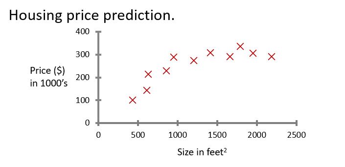
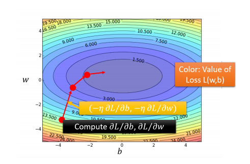
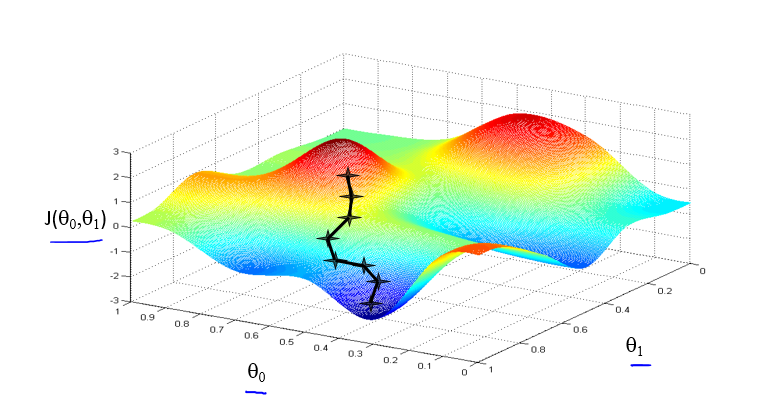
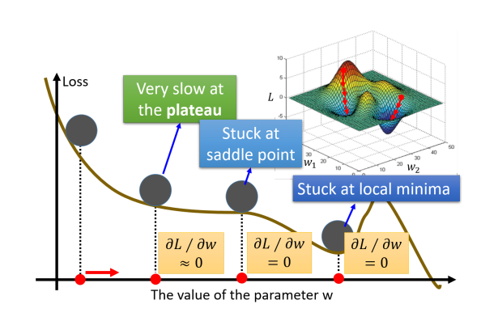

## 引言

这一小节可能对你的线性代数和微积分有一定的基础。在这里我将告诉你，前面的监督学习是如何做到拟合曲线的，这个背后用到的算法就是——**梯度下降（Gredient Descent）**[^1]

## 从线性回归说起...

下面是一张房价预测特征分布的分布曲线（红叉表示数据样本）：

我们要做的是，找到一根直线(也可以是曲线)去尽量的拟合这些数据，这里我们用**线性回归**[^2]来做的这件事。下面我将告诉你线性回归是如何做的。这部分的内容需要你反复推敲和理解，我尽量用人话让你明白。

首先，我们需要一个**预测函数**（你可以理解为拟合数据的曲线），这里我们用的线性回归，所以就定义的是一个线性函数：
$$
h_{\theta}(x)=\theta_{0}+\theta_{1} x
$$
这里有两个参数 $\theta_{0}$和$\theta_{1}$，分别表示两个特征，其实 $\theta_{0}$是 $x_{0}$的系数，但是$x_{0}$ = 1，所以我们也称$\theta_{0}$为**截距**。我们既然要拟合那条曲线，那么我们就要确定$\theta_{0}$和$\theta_{1}$的值。

你会问如何去确定这个参数呢，其实很简单，我们要找的就是衡量参数好坏的标准函数而已。而这个标准函数已经定好了，我们也把他叫做**损失函数(loss function)**，对于线性回归模型，损失函数是这样的：
$$
J\left(\theta_{0}, \theta_{1}\right)=\frac{1}{2 m} \sum_{i=1}^{m}\left(h_{\theta}\left(x^{(i)}\right)-y^{(i)}\right)^{2}
$$
这个公式看不懂没有关系，我慢慢跟你解释。$\left(h_{\theta}\left(x^{(i)}\right)-y^{(i)}\right)$里面的$h_{\theta}\left(x^{(i)}\right)$是表示预测函数预测的值， $y^{(i)}$表示是你用于监督学习的标签数据(正确答案)，两者的差就是**误差**，将误差平方后可以消除负数项，由于有m个数据，这里就先求和再取平均值；这里可能会问为什么会有这个 $\frac{1}{2}$ ，其实这里是方便后面做梯度下降时求导。下面就是如何矫正参数的过程了，也是今天的主角——梯度下降。

## 梯度下降来了

梯度下降中的梯度就是微积分中的**梯度**[^3]了。不懂的好好看看高数书吧，这里我就不多说了。其实这里梯度跟生活中的梯度是一样的：假设你在山坡的某个点上面，往山谷的方向就是梯度的方向。

同理，在三维的曲面上，我们要做的是沿着梯度的方向到达最小值(山谷)的位置：

做梯度下降后是等高线模型上是这样的：

这张图更加直观一点：

一维特征情况下是这样做梯度下降的：

好了，现在该开始和你说，梯度下降是如何工作的了：

线性回归给出的**梯度下降公式**是这样的，通过不断地迭代更新$\theta$:
$$
\theta_{j}:=\theta_{j}-\alpha \frac{\partial}{\partial \theta_{j}} J\left(\theta_{0}, \theta_{1}\right) \quad(\text { for } j=0 \text { and } j=1)
$$

其中的$\alpha$我们称之为**学习率（Learning Rate）**，我们可以通过调节学习率的大小调节，梯度下降时的步长，如何你把学习率设置的太小，他会训练的很慢；从数学上说，就是收敛速度很慢。如果你把学习率设置过，梯度下降就可能直接越过最优解，达不到收敛的效果。如下图：

梯度下降算法，更新参数的公式是这样的：

$$
\begin{array}{l}
\theta_{0}:=\theta_{0}-\alpha \frac{1}{m} \sum_{i=1}^{m}\left(h_{\theta}\left(x^{(i)}\right)-y^{(i)}\right) 
\\\\
\theta_{1}:=\theta_{1}-\alpha \frac{1}{m} \sum^{m}\left(h_{\theta}\left(x^{(i)}\right)-y^{(i)}\right) \cdot x^{(i)}
\end{array}
$$
写代码的时候就可以根据这个公式做到更新迭代参数，只要只要达到了最优解的话，$\left(h_{\theta}\left(x^{(i)}\right)-y^{(i)}\right)$这一项就等于0，$\theta$就不会更新了，从而确定了$\theta$值，$\theta$一确定，拟合曲线就确定了。那么就会像下面这张图片这样：

这样就完成了一个完整的线性回归任务！

## 总结

梯度下降法，是目前最有效的求解最小值的方法，广泛的用于机器学习和深度学习中。梯度下降的原理就是不断地向梯度方向挪一定的步长，从而得到最小值。

## FAQ

1. 梯度下降是不是能够求解所有函数的最优解？

   > 不是，从上面梯度下降的机理来看，梯度下降法只在**凸函数(只有一个极值且最值)** 上面才能够表现得比较好，即函数不能有多个极小值。如果一个函数有多个极小值，那么梯度下降法很容易得到的是**局部最优解**而不是**全局最优解**。

[^1]: [梯度下降_百度百科(baidu.com)](https://baike.baidu.com/item/%E6%A2%AF%E5%BA%A6%E4%B8%8B%E9%99%8D/4864937?fr=aladdin)
[^2]: [线性回归_百度百科(baidu.com)](https://baike.baidu.com/item/%E7%BA%BF%E6%80%A7%E5%9B%9E%E5%BD%92)
[^3]: [梯度_百度百科(baidu.com)](https://baike.baidu.com/item/%E6%A2%AF%E5%BA%A6/13014729)